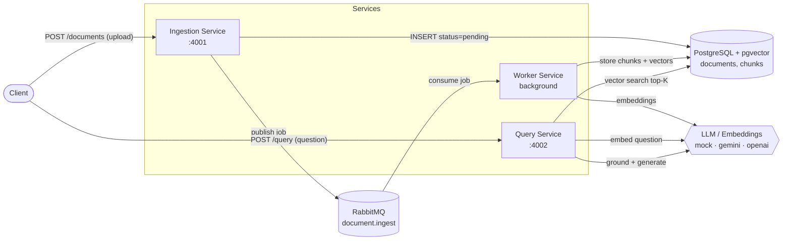

# RAG Docs Assistant

> **Assignment selected: Option 3 — Hard Level (AI-Powered Technical Documentation Assistant).**

A scalable, AI-powered service that answers natural-language questions about a
large set of technical documents using a **Retrieval-Augmented Generation (RAG)**
pipeline. Built as small, independently deployable microservices that
communicate through a message queue and share a PostgreSQL database (relational
**and** vector, via `pgvector`).

It runs **out of the box with no API key** thanks to a built-in `mock` LLM mode,
and switches to a real LLM (Gemini or OpenAI) with a single config change.

---

## Table of Contents
1. [Architecture overview](#architecture-overview)
2. [Service communication flow](#service-communication-flow)
3. [Full RAG workflow](#full-rag-workflow)
4. [Database schema](#database-schema)
5. [Tech stack](#tech-stack)

---

## Architecture overview

Three stateless services around two stateful backing services (Postgres + RabbitMQ):

- **Ingestion Service** (HTTP API) — accepts document uploads, stores a
  `pending` record, and publishes an ingestion job to the queue. Returns
  immediately (`202 Accepted`) so uploads are non-blocking.
- **Worker Service** (background consumer) — does the heavy lifting:
  extract text → chunk → generate embeddings → store. Retries transient
  failures with exponential backoff.
- **Query Service** (HTTP API) — runs the RAG read path: embed the question,
  vector-search the most relevant chunks, ground an LLM, return an answer with
  citations.



---

## Service communication flow

**Write path (asynchronous ingestion):**
1. Client uploads a file to `POST /documents` on the **Ingestion Service**.
2. Ingestion inserts a `documents` row with `status = pending` and **publishes**
   an `IngestJob` (document id + base64 content) to the `document.ingest` queue.
3. Client gets `202 Accepted` immediately and can poll `GET /documents/:id`.
4. The **Worker** consumes the job, sets `status = processing`, extracts text,
   chunks it, generates embeddings, and stores chunks + vectors in one
   transaction, then sets `status = completed` (or `failed`).

**Read path (synchronous query):**
1. Client sends a question to `POST /query` on the **Query Service**.
2. Query embeds the question, runs a cosine-similarity search over `chunks`,
   assembles the top-K chunks as context, and asks the LLM to answer using only
   that context.
3. Response contains the `answer` plus `sources` (filenames + chunk indexes).

Services never call each other directly on the write path — they are decoupled
by the queue, so the worker can be scaled, restarted, or fail independently.

---

## Full RAG workflow

| Stage | Where | What happens |
|------|-------|--------------|
| **Ingest** | Ingestion | Persist metadata, enqueue job |
| **Extract** | Worker | PDF → `pdf-parse`, DOCX → `mammoth`, MD/TXT → utf-8 |
| **Chunk** | Worker | Sentence-aware chunks (`CHUNK_SIZE`, `CHUNK_OVERLAP`) with overlap to preserve cross-boundary meaning |
| **Embed** | Worker | One vector per chunk via the configured provider |
| **Store** | Worker | Text + metadata in `chunks`; vectors in `pgvector` (same row) |
| **Retrieve** | Query | Embed question → `embedding <=> query` cosine search → top-K chunks |
| **Generate** | Query | LLM answers grounded strictly in retrieved context |
| **Cite** | Query | Return source filenames + chunk indexes |

---

## Database schema

PostgreSQL serves as **both** the relational store and the vector store
(`pgvector`). Schema is created automatically on service startup (see
`src/db/migrate.ts`).

```sql
CREATE EXTENSION IF NOT EXISTS vector;

CREATE TABLE documents (
  id           UUID PRIMARY KEY,
  filename     TEXT NOT NULL,
  mime_type    TEXT NOT NULL,
  status       TEXT NOT NULL DEFAULT 'pending', -- pending|processing|completed|failed
  chunk_count  INTEGER NOT NULL DEFAULT 0,
  error        TEXT,
  created_at   TIMESTAMPTZ NOT NULL DEFAULT now(),
  updated_at   TIMESTAMPTZ NOT NULL DEFAULT now()
);

CREATE TABLE chunks (
  id           UUID PRIMARY KEY,
  document_id  UUID NOT NULL REFERENCES documents(id) ON DELETE CASCADE,
  chunk_index  INTEGER NOT NULL,
  content      TEXT NOT NULL,
  embedding    vector(768) NOT NULL,   -- dimension = EMBEDDING_DIM
  created_at   TIMESTAMPTZ NOT NULL DEFAULT now()
);

-- Indexes
CREATE INDEX idx_chunks_document_id ON chunks(document_id);
CREATE INDEX idx_chunks_embedding
  ON chunks USING ivfflat (embedding vector_cosine_ops) WITH (lists = 100);
```

- `documents` — one row per uploaded file; tracks ingestion lifecycle.
- `chunks` — text chunks + their embeddings; `ivfflat` index enables fast
  approximate nearest-neighbour cosine search.

---

## Tech stack

- **Language:** Node.js 20 + TypeScript (strict)
- **HTTP:** Express
- **Queue:** RabbitMQ (`amqplib`)
- **DB:** PostgreSQL 16 + `pgvector`
- **AI:** pluggable provider — `mock` (default), **Gemini**, or **OpenAI**
- **Validation:** Zod
- **Logging:** Pino (structured JSON)
- **Tracing:** OpenTelemetry (opt-in)
- **Containerization:** Docker + Docker Compose

---
